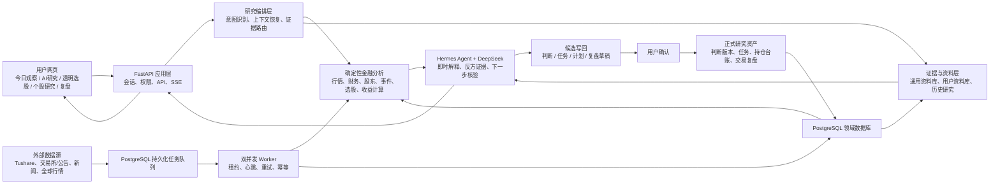
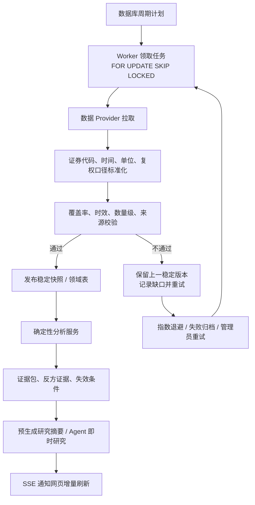
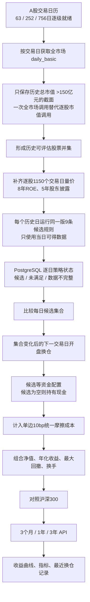
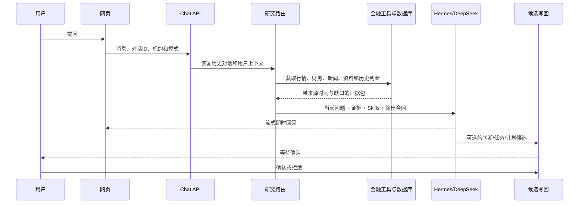

# 清数智算产品流水线与后端逻辑

更新时间：2026-07-26

本文描述当前权威代码库中已经实现的真实链路。图中的 PostgreSQL、持久化队列、确定性分析、Hermes/DeepSeek 和用户确认边界均对应现有代码，不把规划中的能力画成已上线能力。

## 1. 产品主流水线

核心原则：数据工具负责事实和计算，Agent 负责针对当前问题生成解释；保存的报告只能作为证据，不能直接冒充本轮回答。AI 产生的正式判断、任务、计划和复盘均先进入候选区，只有用户确认后才写入正式研究资产。

## 2. 数据获取与后台处理流水线

数据不会因某个上游接口短暂失败就清空。生产读取优先使用最近的稳定版本；失败原因写入后台运行记录，不把供应商错误和内部状态枚举直接展示给普通用户。

## 3. 李总策略长期回测流水线

这条链路没有使用“今天仍然存在的股票”替代历史股票范围。历史市值按交易日保存，避免当前市值倒推造成幸存者偏差。3年窗口额外保留约380个交易日的策略预热数据，因此逐股价格窗口扩展到1150个交易日。

## 4. 研究回答内部逻辑

## 5. 已实施的数据与分析优化

1. 历史市值由“逐股票逐区间获取”改为“每个交易日一次全市场截面”，显著减少接口调用，并且能识别历史上曾跨过150亿元门槛、今天已经跌出门槛的股票。
2. 回测数据从短期单股事件 JSON 提升为 PostgreSQL 中的交易日截面、逐股逐日状态和覆盖记录，可以断点续跑，也能明确区分数据未完成与策略没有候选。
3. 价格历史从700个交易日扩展到1150个交易日，股东披露窗口从3年扩展到5年，为3年回测保留规则预热区间。
4. 候选信号和成交时间分离：收盘后得到的信号只允许在下一交易日开盘执行，避免同收盘价成交的前视偏差。
5. 未达到完整历史覆盖时只显示建设进度，不发布可能受样本缺口影响的收益率。
6. 回测与 Agent 分离：年化收益、回撤和净值由确定性引擎计算，Agent 只能解释结果、指出反方证据和适用边界。
7. 稳定金融快照按数据日期而不是生成时间择新；如果较晚的一次上游重试只返回更早交易日，系统继续读取原有较新稳定版本，防止事实时间倒退。
8. 回测按63、252、756个交易日分阶段扩展。只有某个窗口的全部历史市值截面就绪后，才计算该窗口；更长窗口补齐时再扩大逐股状态范围，不会用0代替尚未取得的历史市值。
9. 每只股票的历史状态保存量价快照、历史市值窗口和计算引擎版本指纹。任一输入改变都会自动判定旧状态过期并重算，已完整且输入未变化的股票可以断点复用。
10. 历史日规则由逐日重复构造数据帧改为等价滚动计算；真实快照抽样逐项对比63日和756日结果均一致，63日抽样速度约提升13倍。后台单批规则核验提升到100只，外部数据同步仍限制并发，避免只追求速度破坏数据稳定性。

## 6. 下一阶段体验与工程优化清单

### P0：直接影响可信度和可用性

- 增加涨停买不到、跌停卖不出、停牌延期成交的逐日可成交性模拟，同时保留当前“理想开盘成交”作为可对照基线。
- 在回测卡片中并列展示毛收益和含成本净收益，并允许查看每次换仓的入选规则证据。
- 为回测后台增加独立的数据健康项：交易日覆盖、历史股票覆盖、逐日状态覆盖、最近完成时间和预计剩余批次。
- 将回测结果加入 Agent 证据路由，使用户可追问“收益主要来自哪些阶段”“最大回撤时持有哪些股票”，但数字仍由确定性工具提供。

### P1：提升数据获取效率

- 为 Tushare 接口建立按端点的速率预算和并发上限，允许全市场截面、逐股历史和常规实时任务错峰运行。
- 将逐股1150日数据补齐拆成可复用的数据依赖任务，同一股票只同步一次，李总策略、个股分析和其他策略共享结果。
- 对历史财务和股东数据使用公告日增量游标，不再重复请求已发布报告期。
- 把回测计算拆成“数据就绪”“规则状态”“组合净值”三个可重跑阶段；上游未变化时只重算受影响的日期和股票。

### P1：提升分析质量

- 增加按年度、牛熊阶段和市场风格的分段归因，避免一个长期年化数字掩盖策略失效阶段。
- 增加组合集中度、单股贡献、行业暴露和换手成本归因，识别收益是否依赖少数异常样本。
- 增加参数冻结后的样本外区间，明确区分规则形成期、验证期和最近观察期。
- 增加与等权全市场、市值门槛股票池和沪深300的多基准对照，区分选股收益与市场风格收益。

### P2：提升用户体验

- 回测首次打开时优先展示最近一个已完成区间，其他区间显示清晰进度，不让整块页面长期空白。
- 换仓记录支持展开查看新增、移除、继续持有及对应规则证据；默认只显示最近8次，避免信息过载。
- 在收益曲线上标注关键换仓和最大回撤区间，点击后可直接让 Agent 解释该历史阶段。
- 提供 CSV 导出和可复制的方法说明，便于金融专家独立复核。

## 7. 关键代码位置

- 应用和 API：`app/main.py`
- PostgreSQL 领域表：`app/domain_schema.py`、`app/db.py`
- 持久化队列与 Worker：`app/operational_db.py`、`app/services/background.py`
- 李总确定性规则：`app/services/strategies/li_zong.py`
- 李总当前截面服务：`app/services/li_zong_strategy_service.py`
- 单股无前视回放：`app/services/li_zong_history.py`
- 组合长期回测：`app/services/li_zong_portfolio_backtest.py`
- Tushare 数据快照：`app/services/tushare_snapshots.py`
- Agent 编排：`app/services/chat_orchestration.py`、`app/services/chat_execution.py`
- 前端回测与选股：`app/static/qs-screening.js`、`app/static/demo.html`
