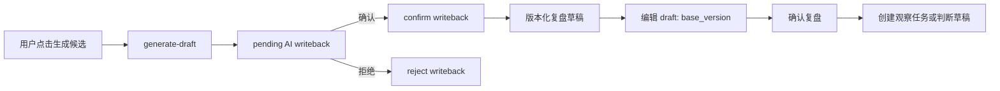

# 研究中心可写闭环设计

## 目标

在既有研究中心中接入交易复盘的候选生成、用户确认、草稿编辑与后续跟进，形成一条可追溯、受版本保护的正式写入链路。它不改变后端业务合同，不自动调用模型，也不把模型输出直接写入正式研究记录。

## 范围与边界

本切片只处理 `TradeReviewCenterSection` 的以下后端既有接口：

| 用户动作 | 接口 | 写入结果 |
| --- | --- | --- |
| 生成 AI 候选 | `POST /v1/trade-reviews/{review_id}/generate-draft` | 创建 `pending_confirmation` 的 AI writeback，不创建正式复盘草稿 |
| 确认或拒绝 AI 候选 | `POST /v1/ai-writebacks/{candidate_id}/confirm` / `reject` | 确认后创建版本化复盘草稿；拒绝只改变候选状态 |
| 编辑已存在草稿 | `PATCH /v1/trade-reviews/{review_id}/draft` | 新建用户来源的草稿版本 |
| 确认 / 归档复盘 | 已接入的 confirm / archive 接口 | 改变复盘状态 |
| 创建后续事项 | `POST /v1/trade-reviews/{review_id}/followups` | 创建观察任务或判断草稿 |

不在本切片中新增后端路由、数据库结构、模型、金融指标、自动执行、批量操作或新的页面路由。

## 状态与安全设计

1. 仅当后端 `can_generate_draft=true` 时显示“生成复盘候选”。点击后显示一次性成本提示，默认 `economy`；用户可以显式选择 `deep`。请求中才传递 `model_tier`。
2. 生成成功返回的是候选写回而非正式草稿。页面显示候选内容、来源和确认 / 拒绝按钮。只有确认 API 返回成功后，才重新读取复盘中心并显示正式草稿。
3. 仅当 `status=draft` 且 `current_version` 存在时允许编辑。表单初始值严格取当前版本的 `price_result`、`logic_result`、`plan_deviation`、`bias_tags`、`improvement_text`；不补写或推导金融结论。
4. 编辑、确认和归档均使用 `current_version.version_no` 作为 `base_version`。409 时清除本地成功状态、刷新复盘列表和候选列表，并要求用户确认最新版本；不重放写入。
5. 仅当复盘状态为 `confirmed` 或 `archived` 时可创建后续事项。后续事项的目标限于后端枚举 `observation_task` / `thesis_draft`，标题和优先级均由用户填写或选择。
6. 401 继续通过应用级统一认证失效链路处理。422、404、409 显示模块级说明，不把错误改写成成功、空状态或默认值。

## 前端结构

- `api.ts`：补充 writeback 列表、生成候选、确认 / 拒绝候选、编辑草稿和创建 followup 的类型化请求；统一将 409 转为 `ResearchCenterApiError`。
- `adapters.ts`：解析复盘版本的 `bias_tags`，并新增受限的 AI writeback 视图模型。未知字段不参与 UI 决策。
- `queries.ts`：新增以用户范围隔离的 pending writeback Query；所有写入成功后失效 `tradeReviews`、`writebacks`、`actions`、`changes`、`outcomes`。
- `ResearchCenterPage.tsx`：保持现有三列结构，在交易复盘卡内增加候选、编辑与后续事项面板。所有危险或产生模型成本的操作都有显式按钮，不在页面加载时触发。
- `ResearchCenterPage.module.css`：复用现有卡片、notice、按钮和移动端断点；390px 下表单单列、按钮可点击且页面根部不横向溢出。

## 数据流

## 错误处理与成本

- 生成候选是唯一模型调用。请求按钮在进行中禁用，失败不产生本地草稿；503 显示可重试说明。
- 对 409，重新读取服务端状态；对 422，展示后端可理解的状态错误；对网络错误，保留用户输入在本地组件状态，但不声称已保存。
- 不使用 localStorage 保存草稿、登录信息、候选或敏感数据。

## 验收与测试

1. API 层测试覆盖正确 URL、`base_version`、model tier、followup 载荷和 409 映射。
2. 页面测试覆盖候选生成、候选确认 / 拒绝、草稿编辑、409 刷新、确认 / 归档、后续事项创建、无权限与不可生成状态。
3. 前端执行 `npm test`、`npm run build`；后端执行与交易复盘 / writeback 相关的定向 pytest。
4. 真实浏览器验收使用认证会话：未操作时不产生模型调用；可生成状态下候选确认后才出现正式草稿；390px 无横向溢出。

## 兼容与回滚

前端只消费既有 OpenAPI 路由，不改数据库或后端合同。部署回滚为恢复上一前端镜像；已生成的候选、草稿、确认记录和 followup 均为既有后端可读记录，不需要数据回滚。
